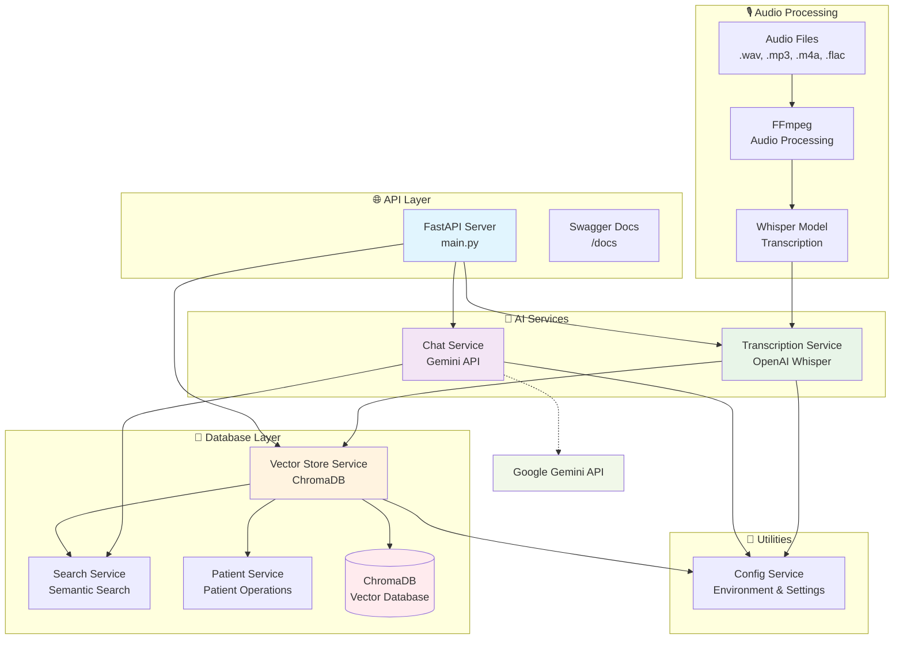

# 🏥 ElSol Challenge - Sistema de Procesamiento de Conversaciones Médicas

## 📋 Descripción del Proyecto

Este proyecto implementa un sistema completo para procesar conversaciones médicas entre promotores y pacientes. El sistema incluye:

- **🎙️ Transcripción de Audio**: Usando Whisper local para transcribir archivos de audio
- **🧠 Almacenamiento Vectorial**: Usando Chroma para almacenar información médica de forma vectorial
- **💬 Chatbot Inteligente**: API para hacer consultas sobre pacientes usando LLM
- **🔍 Búsqueda Semántica**: Capacidad de buscar pacientes por síntomas, diagnósticos, etc.

## 🚀 Instrucciones para Correr el Proyecto

### Prerrequisitos

1. **Python 3.10+**
2. **FFmpeg** instalado y configurado
3. **Variables de entorno** configuradas (opcional para chatbot)

### Instalación

1. **Clonar el repositorio:**
```bash
git clone <repository-url>
cd ElSol-Challenge
```

2. **Crear entorno virtual:**
```bash
python -m venv venv
# En Windows:
venv\Scripts\activate
# En Linux/Mac:
source venv/bin/activate
```

3. **Instalar dependencias:**
```bash
pip install -r requirements.txt
```

4. **Configurar FFmpeg:**
   - Descargar desde: https://ffmpeg.org/download.html
   - Configurar la ruta en `utils/config.py`

5. **Configurar variables de entorno (opcional):**
```bash
# Copiar el archivo de ejemplo
cp .env.example .env
# Editar con tus credenciales de OpenAI/Azure
```

### Ejecución

#### Modo API (Recomendado)
```bash
python main.py --api
```
- Servidor disponible en: http://localhost:8000
- Documentación automática: http://localhost:8000/docs

#### Modo Consola
```bash
python main.py
```
- Procesa archivos de prueba automáticamente

## 📡 Endpoints Disponibles

### 1. 🏠 Root - Información del API
```
GET http://localhost:8000/
```
**Justificación:** Endpoint de salud (health check) que proporciona información básica del servicio, versión y lista de endpoints disponibles. Esencial para monitoreo y documentación.

### 2. 📁 Procesamiento de Audio
```
POST http://localhost:8000/process-audio
```
**Justificación:** Endpoint principal del sistema que:
- Recibe archivos de audio directamente (.wav, .mp3, .m4a, .flac)
- Los guarda en la carpeta `pruebas/`
- Procesa la transcripción automáticamente usando Whisper
- Extrae información estructurada del paciente
- Almacena datos vectorizados en ChromaDB
- Retorna confirmación de guardado exitoso con el nombre del paciente

### 3. 💬 Chatbot Inteligente
```
POST http://localhost:8000/chat
```
**Justificación:** Endpoint del chatbot médico que:
- Recibe preguntas en lenguaje natural
- Analiza el tipo de pregunta (paciente específico, síntomas, diagnósticos, etc.)
- Busca información relevante en la base vectorial de manera semántica
- Genera respuestas contextuales usando LLM (OpenAI/Hugging Face)
- Ejemplos: "¿Qué enfermedad tiene Pepito Gómez?", "Listame pacientes con diabetes", "¿Qué síntomas tiene Juan Pérez?"

## 🧪 Cómo Testear la Funcionalidad

### 1. Probar Procesamiento de Audio
```bash
curl -X POST "http://localhost:8000/process-audio" \
     -F "file=@pruebas/p_52015966_552.wav"
```

### 2. Probar Chatbot
```bash
curl -X POST "http://localhost:8000/chat" \
     -H "Content-Type: application/json" \
     -d '{"question": "¿Qué síntomas tiene Juan Pérez?"}'
```

### 3. Probar API Health
```bash
curl "http://localhost:8000/"
```

### 4. Ejecutar Tests Automáticos
```bash
python test_api.py
```

## 🤔 Supuestos Hechos

1. **Formato de Audio**: Se asume que los archivos de audio están en formatos comunes (.wav, .mp3, .m4a, .flac)
2. **Calidad de Audio**: Se asume una calidad mínima para transcripción efectiva
3. **Idioma**: Se asume que las conversaciones están en español
4. **Estructura de Datos**: Se asume que la información médica sigue patrones comunes
5. **LLM**: Se asume disponibilidad de OpenAI o Hugging Face para el chatbot

## ✅ Buenas Prácticas Aplicadas

### **Arquitectura Modular:**
- **Separación de responsabilidades**: Cada servicio tiene una función específica
- **Servicios independientes**: Fácil mantenimiento y escalabilidad
- **Inyección de dependencias**: Servicios se inicializan de forma limpia

### **Gestión de Datos:**
- **Validación con Pydantic**: Asegura integridad de datos
- **Manejo de errores**: Respuestas consistentes y informativas
- **Logging estructurado**: Facilita debugging y monitoreo

### **Seguridad:**
- **Validación de archivos**: Verificación de tipos y tamaños
- **Limpieza de datos**: Sanitización de inputs
- **Manejo seguro de credenciales**: Variables de entorno

### **Performance:**
- **Almacenamiento vectorial**: Búsquedas semánticas eficientes
- **Caché de modelos**: Whisper se carga una sola vez
- **Procesamiento asíncrono**: No bloquea el servidor

### **Documentación:**
- **API auto-documentada**: Swagger/OpenAPI automático
- **Docstrings completos**: Documentación en código
- **README detallado**: Instrucciones claras

## 📁 Estructura del Proyecto

### 🏗️ Arquitectura del Sistema



### 📂 Estructura de Archivos

```
ElSol-Challenge/
├── main.py                    # Punto de entrada (consola + API)
├── requirements.txt           # Dependencias del proyecto
├── README.md                 # Documentación principal
├── test_api.py              # Tests automáticos
├── test_chat_gemini.py      # Tests del chatbot
├── test_gemini_rest.py      # Tests de Gemini API
├── services/
│   ├── __init__.py
│   ├── transcription_service.py  # Transcripción con Whisper
│   └── chat_service.py           # Chatbot con Gemini
├── database/
│   ├── __init__.py
│   ├── vector_store_service.py   # Servicio principal de almacenamiento
│   ├── search_service.py         # Búsquedas semánticas
│   ├── patient_service.py        # Operaciones de pacientes
│   └── vector_db/                # Base de datos vectorial (Chroma)
├── utils/
│   ├── __init__.py
│   └── config.py                 # Configuración del sistema
└── pruebas/                     # Archivos de audio de prueba
    ├── p_51994013_222.mp3
    └── p_52015966_552.wav
```

## 🔧 Configuración Avanzada

### Variables de Entorno
```bash
# OpenAI Configuration
AZURE_OPENAI_API_KEY=your_openai_api_key_here
AZURE_OPENAI_API_VERSION=2023-12-01-preview
AZURE_OPENAI_API_ENDPOINT=your_azure_endpoint_here
AZURE_OPENAI_DEPLOYMENT=your_deployment_name_here

# Hugging Face (alternativa gratuita)
HUGGINGFACE_TOKEN=your_huggingface_token_here

# Application Configuration
UPLOAD_FOLDER=uploads
MAX_FILE_SIZE=52428800  # 50MB in bytes

# FFmpeg Configuration (Windows)
FFMPEG_PATH=C:\Program Files\ffmpeg\ffmpeg-master-latest-win64-gpl-shared\ffmpeg-master-latest-win64-gpl-shared\bin
```

### Configuración de Whisper
- **Modelo**: "base" (equilibrio entre velocidad y precisión)
- **Idioma**: Español (detectado automáticamente)
- **Formato de salida**: Texto estructurado con metadatos

### Configuración de ChromaDB
- **Persistencia**: Local en carpeta `database/vector_db/`
- **Colecciones**: patients, conversations, symptoms
- **Embeddings**: Automáticos con ChromaDB

## 🚨 Troubleshooting

### Error de FFmpeg
```bash
# Verificar instalación
ffmpeg -version
# Agregar al PATH si es necesario
```

### Error de Whisper
```bash
# Verificar espacio en disco
# Verificar conexión a internet (primera descarga)
# Verificar permisos de escritura
```

### Error de OpenAI
```bash
# Verificar variables de entorno
echo $AZURE_OPENAI_API_KEY
# Verificar configuración de Azure
```

### Error de ChromaDB
```bash
# Eliminar carpeta database/vector_db/ para reiniciar
rm -rf database/vector_db/
# Verificar permisos de escritura
```

## 📈 Próximos Pasos

1. **Mejoras de Performance:**
   - Implementar caché Redis
   - Optimizar embeddings
   - Procesamiento en lotes

2. **Funcionalidades Adicionales:**
   - Autenticación y autorización
   - Dashboard web
   - Exportación de reportes
   - Integración con sistemas médicos

3. **Escalabilidad:**
   - Docker containerization
   - Kubernetes deployment
   - Load balancing
   - Base de datos distribuida

4. **Análisis Avanzado:**
   - Análisis de sentimientos
   - Detección de patrones médicos
   - Predicción de diagnósticos
   - Alertas automáticas

---

**🎉 ¡El sistema está listo para procesar conversaciones médicas de manera inteligente y eficiente!**