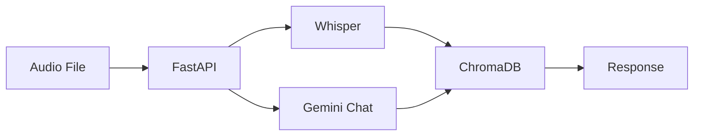
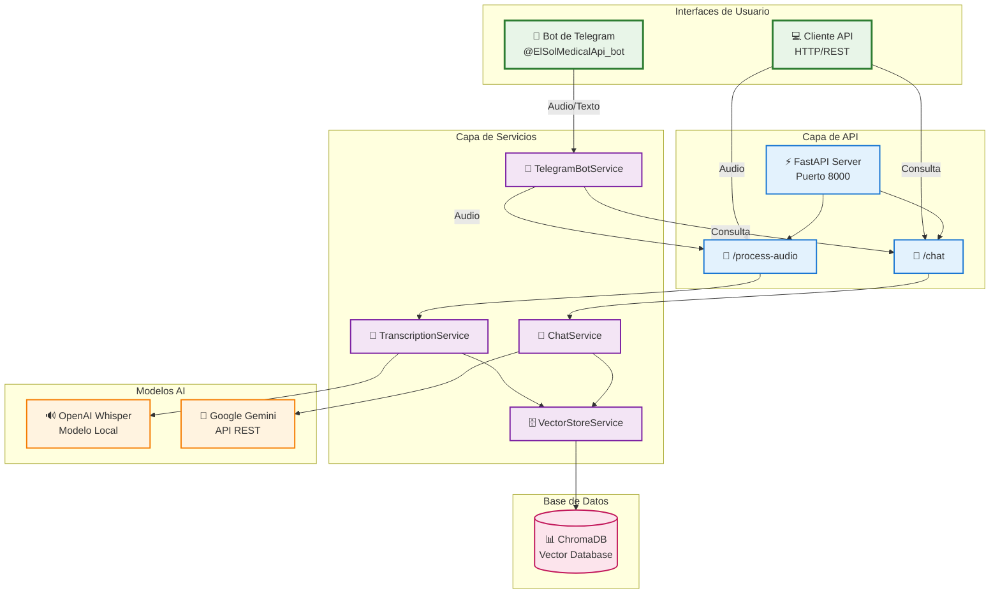

# ElSol Challenge - Medical Conversation BOT

Sistema de procesamiento de conversaciones médicas que transcribe audio, extrae información estructurada y proporciona un chatbot inteligente basado en datos vectorizados.

> **Nota**: Este es un fork del proyecto original de [David-Sol-AI/ElSol-Challenge](https://github.com/David-Sol-AI/ElSol-Challenge)

## Características Principales

- **Transcripción de Audio**: Procesamiento automático de archivos de audio (.wav, .mp3, .m4a, .flac)
- **Extracción de Información**: Análisis automático de datos del paciente (nombre, edad, síntomas, medicamentos)
- **Base de Datos Vectorial**: Almacenamiento semántico usando ChromaDB
- **Chatbot Inteligente**: Asistente médico basado en Google Gemini que responde consultas contextuales
- **API REST**: Interfaz completa con documentación automática

## Arquitectura del Sistema



## Prerrequisitos

- Python 3.8+
- FFmpeg instalado y configurado
- Cuenta de Google Cloud con API de Gemini habilitada

## Instalación

1. **Clonar el repositorio**
   ```bash
   git clone <repository-url>
   cd ElSol-Challenge
   ```

2. **Crear entorno virtual**
   ```bash
   python -m venv venv
   venv\Scripts\activate  # Windows
   source venv/bin/activate  # Linux/Mac
   ```

3. **Instalar dependencias**
   ```bash
   pip install -r requirements.txt
   ```

4. **Configurar variables de entorno**
   Crear archivo `.env` en la raíz del proyecto:
   ```env
   GEMINI_API_KEY=tu_api_key_de_gemini
   ```

## Ejecución

### Modo Completo (Recomendado) - API + Bot
```bash
python main.py
```
- Inicia API automáticamente
- Inicia Bot de Telegram automáticamente (10s delay)
- API: http://localhost:8000
- Bot: @ElSolMedicalApi_bot

### Solo API
```bash
python main.py --api
```
- Servidor disponible en: http://localhost:8000
- Documentación automática: http://localhost:8000/docs

### API + Bot (Explícito)
```bash
python main.py --bot
```
- Igual que el modo por defecto
- Útil para ser explícito sobre la funcionalidad

## Interfaz de Usuario - Bot de Telegram

### 🤖 ElSol Medical Bot
- **Bot de Telegram**: [@ElSolMedicalApi_bot](https://t.me/ElSolMedicalApi_bot)
- **Ubicación**: `services/telegram_bot.py`
- **Funcionalidad**: Interfaz de usuario completa para el sistema
- **Ventajas del Bot**:
  - **Interfaz nativa móvil**: Sin necesidad de desarrollar página web
  - **Escalable**: Fácil expansión para recibir imágenes y documentos
  - **Interacción natural**: Chat conversacional intuitivo
  - **Auto-inicio**: Se ejecuta automáticamente con la API
  - **Mensajes inteligentes**: Contextuales según tipo de consulta

### Características Técnicas
- **Archivos de audio**: .mp3, .wav, .m4a, .flac, .ogg
- **Notas de voz**: Conversión automática .ogg → .wav con FFmpeg
- **Chat médico**: Integración completa con Google Gemini
- **Estadísticas**: Consulta del estado del sistema
- **Nombres de pacientes**: Opcional via descripción de audio

### Comandos del Bot
- `/start` - Iniciar el bot y ver bienvenida
- `/help` - Mostrar ayuda y comandos disponibles
- `/chat <pregunta>` - Realizar consulta médica
- `/stats` - Ver estadísticas del sistema
- **Enviar audio** - Transcribir conversación médica
- **Enviar audio con descripción** - Usar el texto como nombre del paciente

## Endpoints de la API

### 1. Health Check
- **GET** `/`
- **Descripción**: Verifica el estado del servidor
- **Respuesta**: Información del sistema y endpoints disponibles

### 2. Procesamiento de Audio
- **POST** `/process-audio`
- **Descripción**: Sube un archivo de audio, lo transcribe y almacena la información
- **Parámetros**: `file` (archivo de audio)
- **Respuesta**: Confirmación de procesamiento exitoso

### 3. Chat Inteligente
- **POST** `/chat`
- **Descripción**: Chatbot médico que responde consultas basadas en datos vectorizados
- **Parámetros**: `question` (pregunta del usuario)
- **Respuesta**: Respuesta contextual del asistente médico

## Arquitectura del Sistema

### Componentes Principales



### Flujo de Datos

1. **Audio Processing**: Bot/API → TranscriptionService → Whisper → VectorStore → ChromaDB
2. **Chat Queries**: Bot/API → ChatService → Gemini + VectorStore → Respuesta
3. **Integration**: Bot de Telegram actúa como interfaz nativa móvil

## Casos de Uso del Chatbot

### Consultas Médicas
- "¿Cuántos pacientes hay registrados?"
- "¿Qué síntomas tiene Juan Pérez?"
- "¿Qué pacientes tienen fiebre?"
- "¿Hay pacientes con diabetes?"
- "Créame un plan de cuidado para Juan Pérez"

### Consultas No Médicas
- "¿Qué hora es?"
- "Hola, ¿cómo estás?"
- El chatbot responde de manera natural sin usar información médica

## Demostración del Sistema

### Capturas de Pantalla del Bot de Telegram

> **Nota**: Aquí se incluirán capturas de pantalla de las pruebas del chatbot en Telegram

#### Interfaz del Bot
- Captura del comando `/start` y mensaje de bienvenida
- Captura del comando `/help` con lista de comandos disponibles
- Captura del comando `/stats` mostrando estadísticas del sistema

#### Procesamiento de Audio
- Captura del envío de archivo de audio (.mp3, .wav, .ogg)
- Captura del procesamiento con mensaje de confirmación
- Captura del resultado con nombre del paciente extraído

#### Chat Inteligente
- Captura de consulta médica: "¿Cuántos pacientes tenemos?"
- Captura de búsqueda específica: "¿Qué síntomas tiene María?"
- Captura de respuesta contextual del asistente médico

#### Conversión de Formatos
- Captura del envío de nota de voz (.ogg)
- Captura del proceso de conversión automática
- Captura del resultado final procesado

### Demostración de la API

#### Endpoint de Health Check
```
GET http://localhost:8000/
```

#### Procesamiento de Audio
```
POST http://localhost:8000/process-audio
Content-Type: multipart/form-data
```

#### Chat Inteligente
```
POST http://localhost:8000/chat
Content-Type: application/json
{
  "question": "¿Cuántos pacientes tienen fiebre?"
}
```

## Testing

### Ejecutar Todos los Tests
```bash
# Test de transcripción
python test/test_whisper.py

# Test de base de datos
python test/test_chroma.py

# Test completo de API
python test/test_api.py

# Test del chatbot
python test/test_chat_gemini.py

# Test del bot de Telegram
python test/test_telegram_bot.py
```

## Supuestos del Sistema

1. **Formato de Audio**: Soporta .wav, .mp3, .m4a, .flac, .ogg (con conversión automática)
2. **Idioma**: Transcripción optimizada para español
3. **Información del Paciente**: Extracción automática de nombre, edad, género, síntomas
4. **Priorización**: Clasificación automática de urgencia (alta/normal)
5. **Persistencia**: Datos almacenados en ChromaDB con directorio `database/vector_db/`
6. **Seguridad**: Variables de entorno para API keys sensibles
7. **Interfaz de Usuario**: Bot de Telegram como interfaz principal móvil
8. **Nombres de Pacientes**: Opcional via descripción de archivo de audio

## Buenas Prácticas Implementadas

### Arquitectura
- **Separación de responsabilidades**: Servicios modulares y especializados
- **Inyección de dependencias**: Configuración centralizada
- **Manejo de errores**: Try-catch robusto en todas las operaciones
- **Logging**: Registro detallado de operaciones

### Código
- **Docstrings**: Documentación completa de clases y métodos
- **Type hints**: Tipado estático para mejor mantenibilidad
- **Modularización**: Código organizado en servicios específicos
- **Tests**: Cobertura completa con tests unitarios e integración

### Seguridad
- **Variables de entorno**: API keys en archivo .env
- **Validación de entrada**: Pydantic para validación de datos
- **Manejo de archivos**: Validación de tipos y tamaños
- **Directorio temporal**: Tests sin afectar datos reales

## Estructura del Proyecto

```
ElSol-Challenge/
├── main.py                 # Punto de entrada de la aplicación
├── requirements.txt        # Dependencias del proyecto
├── README.md              # Documentación principal
├── documentacion.md        # Documento técnico ejecutivo
├── .env                   # Variables de entorno (no versionado)
├── .gitignore            # Archivos excluidos del versionado
│
├── services/              # Servicios de la aplicación
│   ├── __init__.py
│   ├── transcription_service.py  # Servicio de transcripción (Whisper)
│   ├── chat_service.py           # Servicio de chat con LLM (Gemini)
│   ├── process_conversation.py   # Orquestador de conversaciones
│   └── telegram_bot.py           # Bot de Telegram (interfaz de usuario)
│
├── database/              # Capa de base de datos
│   ├── __init__.py
│   ├── vector_store_service.py   # Servicio principal de ChromaDB
│   ├── search_service.py         # Búsquedas semánticas
│   ├── patient_service.py        # Operaciones de pacientes
│   └── vector_db/               # Datos de ChromaDB (no versionado)
│
├── utils/                 # Utilidades y configuración
│   ├── __init__.py
│   ├── config.py                 # Configuración centralizada
│   ├── setup_telegram_bot.py     # Script de configuración del bot
│   └── configure_bot.py          # Utilidad de configuración de tokens
│
├── test/                  # Tests del sistema
│   ├── test_api.py        # Tests de endpoints de API
│   ├── test_whisper.py    # Tests de transcripción
│   ├── test_chroma.py     # Tests de base de datos
│   ├── test_chat_gemini.py # Tests del chatbot
│   └── test_telegram_bot.py # Tests del bot de Telegram
│
└── pruebas/               # Archivos de audio de prueba (no versionado)
    ├── p_51994013_222.mp3
    └── p_52015966_552.wav
```

## Configuración Avanzada

### Variables de Entorno
```env
# Google Gemini API
GEMINI_API_KEY=tu_api_key_de_gemini

# Configuración de FFmpeg
FFMPEG_PATH=C:\Program Files\ffmpeg\bin
```

### Configuración de ChromaDB
- **Directorio de persistencia**: `database/vector_db/`
- **Colecciones**: `patients`, `conversations`, `symptoms`
- **Embeddings**: Automáticos con ChromaDB

## Troubleshooting

### Problemas Comunes

1. **Error de FFmpeg**
   - Verificar que FFmpeg esté instalado y en el PATH
   - Configurar ruta manual en `transcription_service.py`

2. **Error de API Key de Gemini**
   - Verificar que `GEMINI_API_KEY` esté en el archivo `.env`
   - Confirmar que la API key sea válida

3. **Error de transcripción**
   - Verificar formato de audio soportado
   - Confirmar que el archivo no esté corrupto

4. **Error de base de datos**
   - Verificar permisos de escritura en `database/vector_db/`
   - Eliminar directorio y reiniciar para recrear colecciones

### Logs y Debugging
- Los logs detallados se muestran en la consola
- Usar `--debug` para información adicional
- Revisar logs de ChromaDB en `database/vector_db/`


## Estado del Proyecto

- **Proyecto**: ElSol Challenge - Medical Conversation API
- **Versión**: 1.0.0
- **Última actualización**: Agosto 2025
- **Estado**: ✅ Completado y funcional
- **Características implementadas**:
  - ✅ Transcripción de audio con Whisper (soporte .wav, .mp3, .m4a, .flac, .ogg)
  - ✅ Almacenamiento vectorial con ChromaDB
  - ✅ Chatbot inteligente con Google Gemini
  - ✅ API REST completa con FastAPI
  - ✅ Bot de Telegram como interfaz de usuario móvil
  - ✅ Conversión automática de formatos de audio
  - ✅ Extracción de información estructurada de pacientes
  - ✅ Tests unitarios e integración
  - ✅ Documentación técnica completa
  - ✅ Código modular y bien documentado

## Próximos Pasos

### Funcionalidades Futuras
- **Interfaz Web**: Dashboard administrativo para gestión de pacientes
- **Notificaciones**: Alertas automáticas para casos de alta prioridad
- **Análisis Avanzado**: Reportes y estadísticas detalladas
- **Integración EMR**: Conexión con sistemas de historiales médicos
- **Múltiples Idiomas**: Soporte para transcripción en otros idiomas

### Mejoras Técnicas
- **Escalabilidad**: Implementación de microservicios
- **Seguridad**: Autenticación y autorización robusta
- **Monitoreo**: Logs centralizados y métricas de rendimiento
- **CI/CD**: Pipeline de despliegue automatizado
- **Docker**: Containerización completa del sistema

## Contacto

- **Repositorio**: Fork de [David-Sol-AI/ElSol-Challenge](https://github.com/David-Sol-AI/ElSol-Challenge)
- **Documentación Técnica**: Ver `documentacion.md` para detalles completos
- **Soporte**: Issues en el repositorio principal